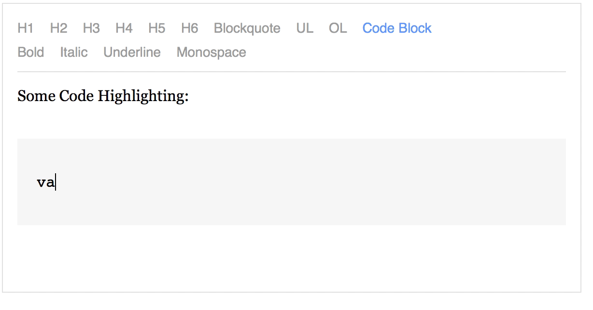

# draft-js-prism

[](http://badge.fury.io/js/draft-js-prism)
[](https://travis-ci.org/SamyPesse/draft-js-prism)

`draft-js-prism` is a decorator for DraftJS to highlight code blocks using [Prism](https://github.com/PrismJS/prism). It only decorates code blocks with syntax highlighting, if you're interested in providing a correct edition UX for code blocks, take a look at [draft-js-code](https://github.com/SamyPesse/draft-js-code).



### Installation

```
$ npm install draft-js-prism
```

### Usage

```js
var Draft = require('draft-js');
var PrismDecorator = require('draft-js-prism');

var decorator = new PrismDecorator();
var editorState = Draft.EditorState.createEmpty(decorator)
```

You'll also need to include the css for one of the [Prism themes](https://github.com/PrismJS/prism/tree/gh-pages/themes).

You can use this decorator combined with others by using [draft-js-multidecorators](https://github.com/SamyPesse/draft-js-multidecorators)

